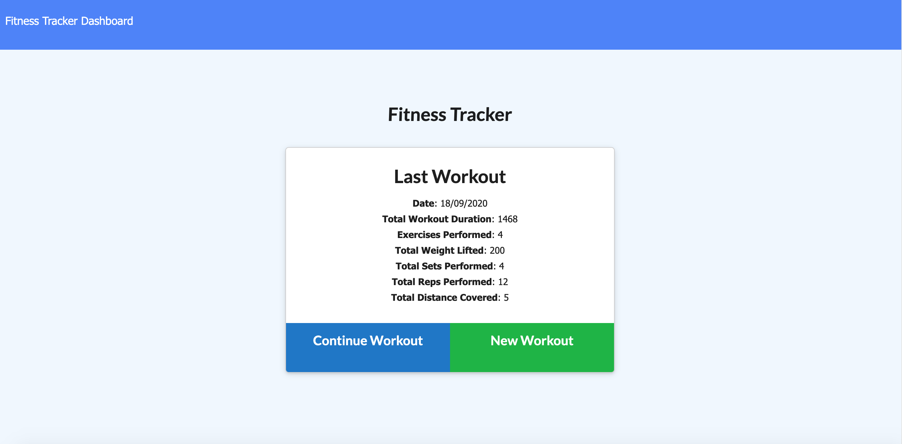

# Fitness Tracker

​
#### Created On: 09/17/2020  

  
​
## Creators
Matt Wieciech  
[wheaties5588](https://github.com/wheaties5588)
  
## Description
App that allows the user to record workouts and track the stats. Add to an existing workout or create a new workout. Built with MongoDB/Mongoose database and Express routing.
## Table of Contents
* [Installation](#installation)
* [Usage](#usage)
* [License](#license)
* [Questions](#questions)

## Installation
1. Clone repo to local
2. Run 'npm install'
3. Run 'npm run seed' to seed the database (optional)
4. Open in browser at http://localhost:3000

## Usage
Track and manage your workouts!

## License
This project is convered under the MIT License.

## Questions
For questions about this project, please see my GitHub at [wheaties5588](https://github.com/wheaties5588), or reach out by email at matt.wieciech@gmail.com.
